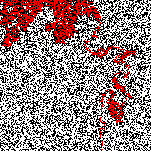
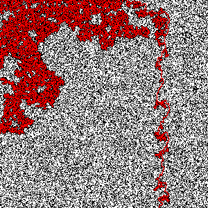
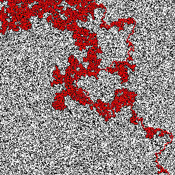
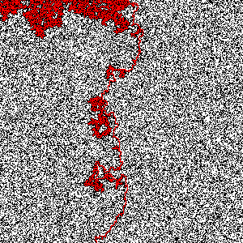
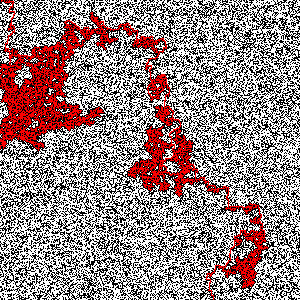
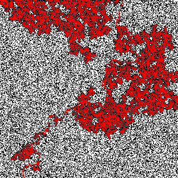
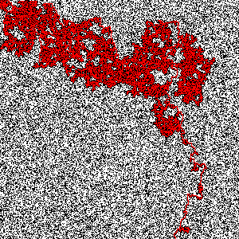
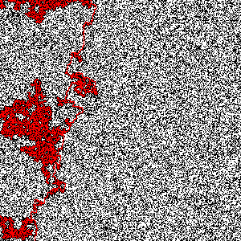
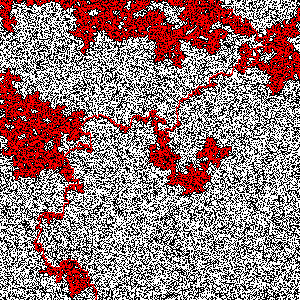
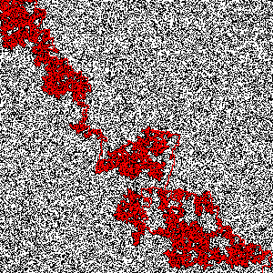

# Percolation-project

Project to determine the percolation threshold of a square. For more information, please visit the wikipedia page on the [Percolation threshold](https://en.wikipedia.org/wiki/Percolation_threshold)

To estimate the percolation threshold probability (which is around 0.593 for a square), A fully mattered 1024x1024 grid is being rendered. 

- At the first trial, no percolation is possible because all the grid is blocked with matter. 
- Then, at the second trial, one random cell of matter is removed. And the percolation is tried again. (which fails naturally also)
- Then, at the third trial, one more random cell of matter is removed. The percolation is tried yet again. (which fails naturally also)
- And so on. Until the percolation algorithm succeeds in finding a path between the top and the bottom.

The first percolation finding algorithm is a 'naive search' that tries every single possible path to determine if one goes from the top to the bottom. This takes some time... approximately 10 minutes to estimate the percolation probability.

The second algorithm is a 'union-find' where each explored cell is linked and remembered. Naturally, this requires more memory, but the time needed goes from 10 minutes to not even 1 second !

